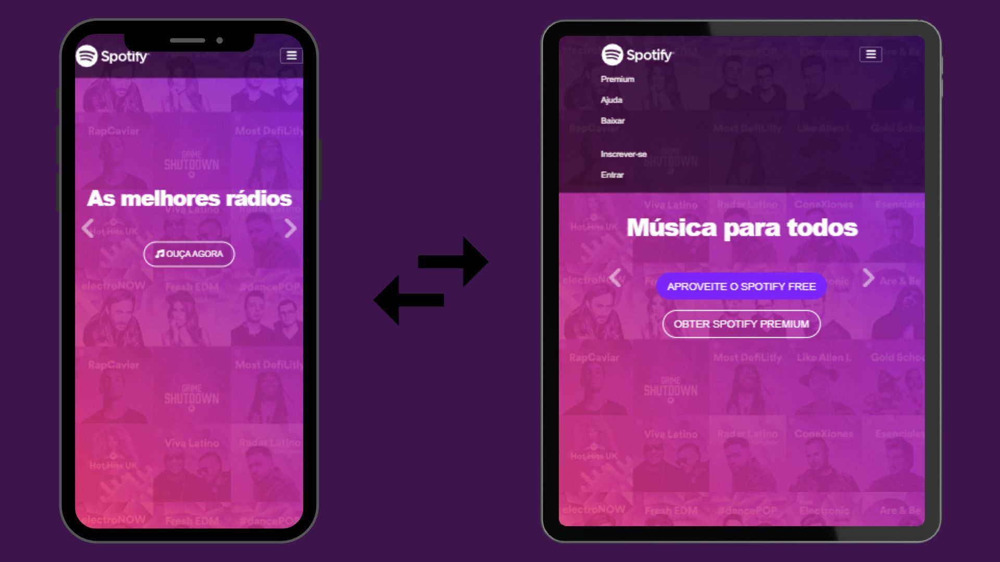

# Projeto spotify

## clone da página inicial do spotify

<a href="https://joselucas77.github.io/projeto-spotify/">🔗 Acesse aqui o projeto</a>

## Tecnologias ultilizadas e informações adicionais

- HTML e CSS
- site responsivo
